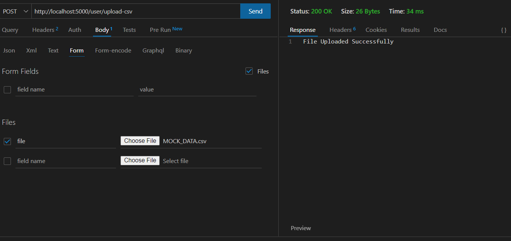

# file-system

# Prerequisites

- ### Docker should be up and running in your system.

# Steps to run the Application

- ### Pull the application from the github link

- ### Open your terminal/command prompt

- ### To start the application, RUN command:  docker-compose up 

- ### Open an Rest API Client Thunder Client or POSTMAN and create a new POST Request

- ### Enter the url:- http://localhost:5000/user/upload-csv

- ### Attach a file as in the screenshot with the field name - file under form body

- ### Execute it.

- ### To test this endpoint, a sample CSV file is attached in the path ./assets

# DB Data Result

# Run Unit Test
- ### To start the application, RUN command:  docker-compose up 
- ### RUN command:  npm run test 

